# Atlassian MCP Client

[](https://www.python.org/downloads/)
[](https://github.com/jlowin/fastmcp)
[](https://opensource.org/licenses/MIT)
[](https://modelcontextprotocol.io/)

**Professional MCP (Model Context Protocol) client with OAuth authentication for seamless integration with Atlassian tools (Jira & Confluence) via the official Atlassian MCP Server.**

🚀 **Zero-configuration OAuth** • 🔧 **25+ Atlassian tools** • 📡 **Universal MCP framework** • ⚡ **Production ready**

## Features

- ✅ **Automatic OAuth 2.0 authentication** with Atlassian
- ✅ **25+ Jira and Confluence tools** ready to use
- ✅ **Universal MCP client** for any MCP server
- ✅ **Interactive mode** for tool testing and development
- ✅ **Server-Sent Events (SSE)** transport via mcp-remote
- ✅ **Cloud ID discovery** and caching
- ✅ **Multi-server configuration** support

## Quick Install

### Prerequisites

- **Python 3.13+**
- **Node.js** (for mcp-remote transport)
- **Atlassian account** with access to Jira/Confluence

### Installation

```bash
# Clone the repository
git clone https://github.com/yourusername/atlassian-mcp-client.git
cd atlassian-mcp-client

# Initialize project with uv (recommended)
uv init --no-readme
uv venv .venv

# Activate virtual environment
source .venv/bin/activate  # Linux/macOS
# or on Windows: .venv\Scripts\activate

# Install dependencies
uv sync

# Alternative: Install with pip
# python -m venv .venv
# source .venv/bin/activate
# pip install -e .

# Run the demo
uv run simple_mcp_demo.py
```

### First Run

```bash
$ uv run simple_mcp_demo.py
🚀 Simple MCP Demo
========================================
✅ Connected!
🏓 Ping: OK

🔧 Available tools:
  • atlassianUserInfo - Get current user info from Atlassian
  • getJiraIssue - Get the details of a Jira issue
  • createJiraIssue - Create a new Jira issue
  ... (22 more tools)

📊 Total tools: 25
🎯 Testing tool call...
✅ Tool call successful!
📄 Result: {"name":"John Doe","email":"john@example.com"...}
```

## Architecture

```
User Application → MCP Client → OAuth → FastMCP → mcp-remote → Atlassian MCP Server → Jira/Confluence APIs
```

### Components

| Component | Description | Lines of Code |
|-----------|-------------|---------------|
| `simple_mcp_demo.py` | Simple demo client with OAuth | 54 |
| `universal_mcp.py` | Universal MCP client framework | 113 |
| `mcp.json` | Atlassian MCP server configuration | - |
| `mcp_examples.json` | Example configurations for other servers | - |

## FastMCP Integration

This project leverages the [FastMCP SDK](https://github.com/jlowin/fastmcp) for MCP protocol implementation:

### Basic Usage

```python
import asyncio
import json
from fastmcp import Client

async def main():
    # Load MCP server configuration
    with open("mcp.json", "r") as f:
        config = json.load(f)
    
    # Create FastMCP client
    client = Client(config)
    
    # Use async context manager for connection lifecycle
    async with client:
        # Test connection
        await client.ping()
        
        # Discover available tools
        tools = await client.list_tools()
        print(f"Found {len(tools)} tools")
        
        # Execute a tool
        result = await client.call_tool("atlassianUserInfo", {})
        print(f"User info: {result}")

asyncio.run(main())
```

### Configuration Format

The `mcp.json` file follows FastMCP configuration standards:

```json
{
  "mcpServers": {
    "atlassian": {
      "command": "npx",
      "args": ["-y", "mcp-remote", "https://mcp.atlassian.com/v1/sse"]
    }
  }
}
```

### Multi-Server Support

```json
{
  "mcpServers": {
    "atlassian": {
      "command": "npx", 
      "args": ["-y", "mcp-remote", "https://mcp.atlassian.com/v1/sse"]
    },
    "github": {
      "command": "npx",
      "args": ["-y", "@modelcontextprotocol/server-github"]
    },
    "filesystem": {
      "command": "npx",
      "args": ["-y", "@modelcontextprotocol/server-filesystem", "/path/to/files"]
    }
  }
}
```

## OAuth 2.0 Authentication

### How OAuth Works

1. **Connection**: Client connects to Atlassian MCP Server via SSE transport
2. **Tool Call**: First tool call (`atlassianUserInfo`) triggers OAuth flow
3. **Browser Redirect**: Automatic browser opening with OAuth consent page
4. **User Authentication**: User logs in and grants permissions
5. **Token Exchange**: OAuth code exchanged for access/refresh tokens
6. **Resource Discovery**: `getAccessibleAtlassianResources` provides Cloud ID
7. **Persistence**: Cloud ID cached locally for future use

### OAuth Flow

```mermaid
flowchart LR
    A["🚀 Run Script"] --> B["🔌 Connect to MCP"]
    B --> C["🔑 OAuth Required?"]
    C -->|Yes| D["🌐 Open Browser"]
    C -->|No| H["✅ Use Cached Token"]
    D --> E["👤 User Login"]
    E --> F["💾 Save Token"]
    F --> G["🎯 Call Jira/Confluence"]
    H --> G
    G --> I["📊 Return Data"]
```



### Simple Authentication Flow


### Token Storage

**Real OAuth tokens** (managed by mcp-remote):
```bash
~/.mcp-auth/mcp-remote-0.1.17/
├── {hash}_tokens.json          # Access & refresh tokens
├── {hash}_client_info.json     # OAuth client configuration  
└── {hash}_code_verifier.txt    # PKCE code verifier
```

**Local cache** (managed by client):
```bash
.atlassian_auth.json            # Cloud ID cache
```

### Token Format

```json
{
  "access_token": "USER_ACCOUNT_ID:CLIENT_ID:ACCESS_TOKEN_SECRET",
  "token_type": "bearer",
  "expires_in": 3300,
  "refresh_token": "USER_ACCOUNT_ID:CLIENT_ID:REFRESH_TOKEN_SECRET"
}
```

## Available Tools

### Jira Tools (11 tools)

| Tool | Description | Parameters |
|------|-------------|------------|
| `getJiraIssue` | Get issue details | `cloudId`, `issueIdOrKey` |
| `createJiraIssue` | Create new issue | `cloudId`, `projectKey`, `summary`, `description` |
| `editJiraIssue` | Edit existing issue | `cloudId`, `issueIdOrKey`, `fields` |
| `searchJiraIssuesUsingJql` | Search issues with JQL | `cloudId`, `jql`, `maxResults` |
| `transitionJiraIssue` | Change issue status | `cloudId`, `issueIdOrKey`, `transitionId` |
| `addCommentToJiraIssue` | Add comment to issue | `cloudId`, `issueIdOrKey`, `body` |
| `getVisibleJiraProjects` | List accessible projects | `cloudId` |
| `getTransitionsForJiraIssue` | Get available transitions | `cloudId`, `issueIdOrKey` |
| `lookupJiraAccountId` | Find user account | `cloudId`, `query` |
| `getJiraIssueRemoteIssueLinks` | Get external links | `cloudId`, `issueIdOrKey` |
| `getJiraProjectIssueTypesMetadata` | Get issue type metadata | `cloudId`, `projectIdOrKey` |

### Confluence Tools (12 tools)

| Tool | Description | Parameters |
|------|-------------|------------|
| `getConfluenceSpaces` | List Confluence spaces | `cloudId` |
| `getConfluencePage` | Get page content | `cloudId`, `pageId` |
| `createConfluencePage` | Create new page | `cloudId`, `spaceId`, `title`, `body` |
| `updateConfluencePage` | Update existing page | `cloudId`, `pageId`, `version`, `title`, `body` |
| `getPagesInConfluenceSpace` | List pages in space | `cloudId`, `spaceId` |
| `getConfluencePageAncestors` | Get page hierarchy (up) | `cloudId`, `pageId` |
| `getConfluencePageDescendants` | Get page hierarchy (down) | `cloudId`, `pageId` |
| `createConfluenceFooterComment` | Add footer comment | `cloudId`, `pageId`, `body` |
| `createConfluenceInlineComment` | Add inline comment | `cloudId`, `pageId`, `body` |
| `searchConfluenceUsingCql` | Search with CQL | `cloudId`, `cql`, `limit` |
| `getConfluencePageFooterComments` | Get footer comments | `cloudId`, `pageId` |
| `getConfluencePageInlineComments` | Get inline comments | `cloudId`, `pageId` |

### General Tools (2 tools)

| Tool | Description | Parameters |
|------|-------------|------------|
| `atlassianUserInfo` | Get current user info | None |
| `getAccessibleAtlassianResources` | Get Cloud IDs | None |

## Usage Examples

### Basic Tool Usage

```python
import asyncio
import json
from fastmcp import Client

async def example():
    with open("mcp.json", "r") as f:
        config = json.load(f)
    
    client = Client(config)
    
    async with client:
        # Get user information (triggers OAuth if needed)
        user_info = await client.call_tool("atlassianUserInfo", {})
        print(f"Authenticated as: {user_info}")
        
        # Get Cloud ID
        resources = await client.call_tool("getAccessibleAtlassianResources", {})
        cloud_id = json.loads(resources[0].text)[0]['id']
        
        # Search Jira issues
        issues = await client.call_tool("searchJiraIssuesUsingJql", {
            "cloudId": cloud_id,
            "jql": "project = 'TEST' AND status = 'Open'",
            "maxResults": 10
        })
        
        # Create Confluence page
        page = await client.call_tool("createConfluencePage", {
            "cloudId": cloud_id,
            "spaceId": "SPACE_ID",
            "title": "My New Page",
            "body": "<p>Page content here</p>"
        })

asyncio.run(example())
```

### Interactive Mode

```bash
# Launch interactive tool testing
uv run universal_mcp.py --interactive

# Select tools by number and test with parameters
🎮 Interactive Mode
========================================

Enter tool number (1-25) or 'q' to quit:
> 1

🎯 Calling: atlassianUserInfo
✅ Success!
📄 Result: {"name":"John Doe","email":"john@example.com"...}
```

## Troubleshooting

### Common OAuth Issues

**Problem**: "Hmm... We're having trouble logging you in"
```bash
Solution: Ensure you have access to at least one Atlassian site
- Create free site: https://start.atlassian.com/
- Check existing sites: https://admin.atlassian.com/
```

**Problem**: "Invalid redirect_uri"
```bash
Solution: Callback server issues - ensure port 5598 is available
- Check: netstat -tulpn | grep 5598
- Kill conflicting processes if needed
```

**Problem**: "No Atlassian sites found"
```bash
Solution: Account needs site access
- Request invitation from site admin
- Create new free Atlassian site
- Verify account permissions
```

### Connection Issues

**OAuth callback timeout**:
```bash
# Verify callback server is running
curl http://localhost:5598/health

# Check firewall settings
sudo ufw status
```

**SSE transport failures**:
```bash
# Force SSE-only transport
export MCP_TRANSPORT_STRATEGY=sse-only
uv run simple_mcp_demo.py
```

### Token Management

**Clear OAuth cache**:
```bash
# Remove all cached tokens
rm -rf ~/.mcp-auth/

# Remove local Cloud ID cache
rm .atlassian_auth.json

# Re-run for fresh OAuth flow
uv run simple_mcp_demo.py
```

**Check token expiry**:
```bash
# View current tokens
cat ~/.mcp-auth/mcp-remote-*/bbcf*_tokens.json | jq .expires_in
# Returns: 3300 (55 minutes from issue)
```

## Development

### Project Structure

```
.
├── simple_mcp_demo.py          # Simple demo client (54 lines)
├── universal_mcp.py            # Universal MCP framework (113 lines)
├── mcp.json                    # Atlassian server configuration
├── mcp_examples.json           # Example server configurations
├── pyproject.toml              # Python dependencies
├── .atlassian_auth.json        # Cached Cloud ID (auto-generated)
└── README.md                   # This documentation
```

### Adding New MCP Servers

1. **Add server to configuration**:
```json
{
  "mcpServers": {
    "your_server": {
      "command": "python",
      "args": ["your_mcp_server.py"],
      "env": {"DEBUG": "true"}
    }
  }
}
```

2. **Test with universal client**:
```bash
uv run universal_mcp.py --interactive
```

### Dependencies

```toml
[dependencies]
fastmcp = ">=2.9.2"
python-dotenv = ">=1.1.1"

[build-system]
requires = ["hatchling"]
build-backend = "hatchling.build"
```

## Contributing

### Setup Development Environment

```bash
# Clone repository
git clone https://github.com/yourusername/atlassian-mcp-client.git
cd atlassian-mcp-client

# Install development dependencies
uv sync --dev

# Run tests
uv run pytest

# Format code
uv run black .
uv run isort .
```

### Contribution Guidelines

1. **Fork** the repository
2. **Create** feature branch: `git checkout -b feature-name`
3. **Make** changes with tests
4. **Ensure** code formatting: `uv run black . && uv run isort .`
5. **Commit** changes: `git commit -m "Add feature"`
6. **Push** branch: `git push origin feature-name`
7. **Create** Pull Request

### Code Standards

- **Python 3.13+** compatibility
- **Type hints** for all functions
- **Async/await** for I/O operations
- **Error handling** with descriptive messages
- **Documentation** for public APIs

## Resources

- **[Model Context Protocol](https://modelcontextprotocol.io/)** - Official MCP specification
- **[FastMCP SDK](https://github.com/jlowin/fastmcp)** - Python MCP implementation
- **[Atlassian MCP Server](https://mcp.atlassian.com/)** - Official Atlassian MCP server
- **[Atlassian Developer](https://developer.atlassian.com/)** - Atlassian API documentation

## License

This project is licensed under the MIT License - see the [LICENSE](LICENSE) file for details.

## Changelog

### Version 1.0.0 (Initial Release)

- ✅ Full OAuth 2.0 authentication with Atlassian
- ✅ 25+ Jira and Confluence tools available
- ✅ Universal MCP client framework
- ✅ Interactive tool testing mode
- ✅ Production-ready architecture
- ✅ Comprehensive documentation

---

**Built with ❤️ using [FastMCP](https://github.com/jlowin/fastmcp) and the [Model Context Protocol](https://modelcontextprotocol.io/)**
